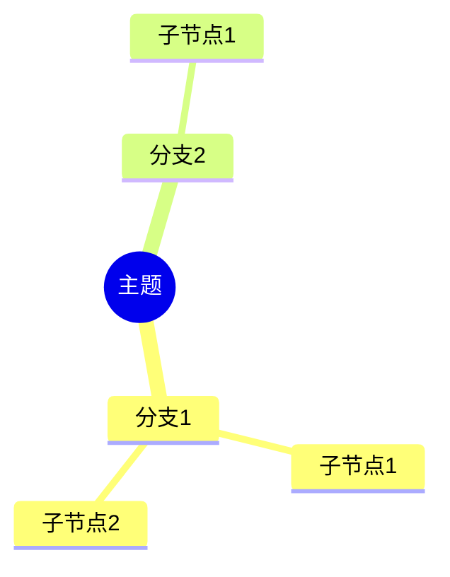

# AI Workbench 使用说明

## 多平台草稿发布

### 配置平台

1. 打开“设置 → 社区插件 → AI Workbench”。
2. 找到“发布平台”，启用需要的平台。
3. 选择“官方 API”或“Webhook”。
4. 填写凭据后点击“测试连接”。

微信公众号和 YouTube 支持官方接入。小红书、视频号、抖音和 X 在本版本中使用 Webhook 中转服务。插件不会在官方接口失败后自动改走 Webhook，也不会自动公开发布。

### Webhook 配置

- `Webhook URL`：创建草稿的 JSON 接口。
- `媒体上传 URL`：上传 Obsidian 本地图片或视频，含本地媒体时必填。
- 认证：无、Bearer Token 或自定义请求头。
- 签名密钥：可选；启用后使用 HMAC-SHA256。

签名请求头为 `X-AI-Workbench-Timestamp`、`X-AI-Workbench-Signature` 和 `Idempotency-Key`。

### 创建草稿

1. 打开一篇 Markdown 笔记。
2. 在 AI 工作台的“发布到草稿箱”区域勾选平台。
3. 点击“编辑并发布”。
4. 编辑统一内容，必要时切换平台标签设置覆盖内容。
5. 选择封面、图片或视频后提交。
6. 在结果区查看草稿 ID、管理链接或错误。

若只有部分平台失败，可点击“仅重试失败平台”。重试会沿用原幂等键，降低重复创建草稿的风险。

平台凭据保存在本地插件数据中，但 Obsidian 默认不会加密这些字段。请勿分享插件 `data.json`，并优先使用 HTTPS Webhook。连接测试不会发送当前笔记内容。

## 新增功能速览：小红书与短视频

### 小红书自动排版

AI Workbench 已内置“小红书自动排版”和“排版并发布草稿”两个自动化入口。

- “小红书自动排版”：读取当前 Markdown 笔记，按小红书风格生成标题候选、正文和话题标签，并另存为新笔记。
- “排版并发布草稿”：先完成小红书排版，再把排版后的内容提交到小红书草稿箱。
- 两个入口会显示在 AI Workbench 侧边栏的“小红书”分类中，也可以从命令面板搜索执行。
- 自动化入口默认启用，可在 `设置 → AI Workbench → 自定义 Prompt` 中关闭或重新启用。

使用前建议先打开 `设置 → AI Workbench → 小红书自动排版`，检查或调整排版规则。留空会恢复默认规则。

如需发布到小红书草稿箱，还需要在 `设置 → AI Workbench → 发布平台 → 小红书` 中启用平台并配置 Webhook。小红书当前通过 Webhook 中转服务创建草稿，不会自动公开发布。

#### 小红书草稿中转服务

小红书没有直接开放给个人插件使用的通用草稿 API，本项目提供了一个本地中转脚本，通过带调试端口的 Edge 自动填写小红书创作服务平台。

1. 关闭所有 Edge 窗口。
2. 用调试端口启动 Edge：

```powershell
Start-Process msedge.exe -ArgumentList '--remote-debugging-port=9222','--user-data-dir=%TEMP%\xhs-edge-profile','https://creator.xiaohongshu.com'
```

3. 在新打开的 Edge 窗口中登录小红书创作服务平台。
4. 在项目目录启动中转服务：

```powershell
node scripts/xhs-draft-server.mjs
```

5. 在 `设置 → AI Workbench → 发布平台 → 小红书` 中填写：

```text
Webhook URL: http://127.0.0.1:3021/xhs/draft
媒体上传 URL: http://127.0.0.1:3021/xhs/media
认证方式: 无
```

如果发布结果提示“无法连接 Edge 调试端口 9222”，说明第 2 步的 Edge 没有启动成功，或被已有 Edge 进程复用了普通窗口。请先关闭所有 Edge 窗口后重新启动。

### 短视频一键生成

短视频模块已增加“一键生成短视频”能力，可根据当前短视频文案或脚本生成视频文件。

1. 打开一篇 Markdown 笔记，或选中文案/脚本片段。
2. 在 AI Workbench 侧边栏的“短视频”分类点击“一键生成短视频”，也可以在命令面板搜索“一键生成短视频”。
3. 插件会优先使用选中文字；没有选区时使用当前笔记全文。
4. 文本 AI 会先把文案整理成适合视频模型的镜头化提示词。
5. 视频生成成功后，会保存到当前笔记旁边的素材目录，并在原笔记末尾插入视频嵌入链接。

示例输出：

```text
短视频脚本.md
短视频脚本-assets/
  video-01.mp4
```

笔记末尾会追加：

```markdown
## AI 生成短视频

![[短视频脚本-assets/video-01.mp4]]
```

#### 配置视频 API

打开 `设置 → AI Workbench → 短视频生成`，配置：

1. 视频提供商：默认使用 OpenAI 兼容 API。
2. 视频 API 基础地址：例如云雾或其他兼容网关地址。
3. 视频 API Key。
4. 视频模型名称。
5. 视频尺寸：竖屏短视频默认 `1080x1920`。
6. 视频时长：默认 5 秒。
7. 超时、失败重试、轮询间隔和最大轮询次数。

当前版本的通用适配器会调用 `{endpoint}/videos/generations`，支持：

- 直接返回 `b64_json` / `base64` 视频数据。
- 返回视频下载 `url`。
- 返回异步任务 ID，并通过 `{endpoint}/videos/generations/{taskId}` 轮询结果。

云雾、即梦、可灵或其他服务只要能通过兼容网关返回上述格式，就可以直接配置使用。若某个平台接口格式不同，后续只需要新增 provider adapter，不需要改动主工作流。

#### 与发布功能配合

生成的视频会作为 Obsidian 本地视频嵌入到笔记中。随后可以使用“发布到草稿箱”功能，将同一篇笔记提交到支持视频素材的平台，例如视频号、抖音或 YouTube。含本地视频时，目标平台的 Webhook 配置中必须填写“媒体上传 URL”。

#### 其他电脑使用

视频生成配置保存在插件 `data.json` 中。使用 Obsidian Sync 或手动复制插件数据时，视频 endpoint、模型、尺寸、时长等设置会一起迁移；API Key 也会随插件数据同步，但默认不是加密字段。不要把包含密钥的 `data.json` 分享给他人。

> AI 驱动的 Obsidian 笔记工作台，一键完成总结、翻译、思维导图等操作

**版本：** 0.1.1
**更新日期：** 2026年6月18日
**仓库：** https://github.com/zfz584521-collab/obsidian-ai-workb
**作者：** AI Workbench Team

---

## 📑 目录

- [快速开始](#快速开始)
- [本机使用说明](#本机使用说明)
- [其他电脑使用说明](#其他电脑使用说明)
- [功能详解](#功能详解)
- [配置指南](#配置指南)
- [常见问题](#常见问题)
- [故障排除](#故障排除)
- [最佳实践](#最佳实践)

---

## 快速开始

### 系统要求

- **Obsidian 版本：** 1.4.0 或更高
- **操作系统：** Windows / macOS / Linux
- **网络：** 需要访问 AI API（OpenAI、Claude 等）
- **API 密钥：** 需要 OpenAI 或兼容 API 的密钥

### 5分钟快速上手

1. **安装插件** → 2. **配置 API** → 3. **开始使用**

---

## 本机使用说明

### 一、安装插件

#### 方法1：从发布页面安装（推荐）

```bash
# 1. 下载最新版本
# 访问项目的 GitHub Releases 页面
# 下载 main.js, manifest.json, styles.css

# 2. 创建插件目录
在你的 Obsidian 库中创建文件夹：
.obsidian/plugins/ai-workbench/

# 3. 复制文件
将下载的文件复制到该文件夹中

# 4. 重启 Obsidian
关闭并重新打开 Obsidian
```

#### 方法2：从源码编译安装

```bash
# 1. 克隆或下载源码
git clone <repository-url>
# 或下载 ZIP 文件并解压

# 2. 安装依赖
cd ai-workbench
npm install

# 3. 编译插件
npm run build

# 4. 复制编译结果
将生成的 main.js、manifest.json、styles.css
复制到 .obsidian/plugins/ai-workbench/ 目录

# 5. 重启 Obsidian
```

#### 方法3：开发模式（热重载）

```bash
# 1. 进入插件目录
cd /path/to/your/vault/.obsidian/plugins/

# 2. 克隆仓库
git clone <repository-url> ai-workbench

# 3. 安装依赖
cd ai-workbench
npm install

# 4. 启动开发模式
npm run dev

# 5. 在 Obsidian 中启用插件
# 设置 → 社区插件 → 刷新 → 找到 AI Workbench → 启用
```

---

### 二、配置 API

#### 步骤1：获取 API 密钥

**OpenAI（推荐）**
```
1. 访问 https://platform.openai.com/
2. 注册/登录账号
3. 进入 API Keys 页面
4. 点击 "Create new secret key"
5. 复制生成的密钥（以 sk- 开头）
```

**Claude API**
```
1. 访问 https://console.anthropic.com/
2. 注册/登录账号
3. 进入 API Keys 页面
4. 创建新的 API 密钥
5. 复制生成的密钥
```

**国内中转服务**
```
推荐使用：
- OpenAI 中转：api.openai-proxy.com
- Claude 中转：api.claude-ai.pro
- 其他服务商（自行搜索）

注意：选择信誉良好的服务商
```

#### 步骤2：在插件中配置

```
1. 打开 Obsidian
2. 点击左下角齿轮图标（设置）
3. 找到 "社区插件" → "AI Workbench"
4. 点击插件旁边的齿轮图标

5. 填写配置：
   ├─ API 端点：https://api.openai.com/v1
   │  （国内中转填写中转地址）
   ├─ API Key：sk-xxxxx...xxxx
   ├─ 模型：gpt-4o-mini
   │  （推荐 gpt-4o-mini，性价比高）
   └─ 超时时间：60秒（默认）

6. 点击其他地方自动保存
```

#### 步骤3：测试连接

```
1. 打开任意笔记
2. 按 Ctrl+Alt+S（Windows）或 ⌘+Alt+S（Mac）
3. 等待几秒，应该看到总结内容
4. 如果失败，检查错误提示
```

---

### 三、基本使用

#### 1. 快捷操作

**方式1：命令面板**
```
1. 按 Ctrl+P（Windows）或 ⌘+P（Mac）打开命令面板
2. 输入 "AI Workbench" 或 "总结"
3. 选择要执行的操作
```

**方式2：快捷键**
```
Ctrl+Alt+S → 总结当前笔记
Ctrl+Alt+T → 翻译笔记
Ctrl+Alt+M → 生成思维导图
```

**方式3：侧边栏**
```
1. 点击左侧边栏的 ✨ 图标
2. 打开 AI 工作台面板
3. 点击对应的操作按钮
```

**方式4：右键菜单**
```
1. 在编辑器中选中文字
2. 右键点击
3. 选择 "AI 操作" → 对应功能
```

#### 2. 处理选中文本

```
1. 用鼠标选中要处理的文字
2. 执行任意 AI 操作
3. AI 只会处理选中的内容
4. 处理结果会替换选中的文字
```

#### 3. 处理整个笔记

```
1. 不选中任何文字（光标在笔记中即可）
2. 执行 AI 操作
3. AI 会处理整个笔记内容
4. 结果根据设置追加、插入或新建文件
```

---

### 四、高级功能

#### 1. 自定义 Prompt

**创建自定义 Prompt**
```
1. 打开设置 → AI Workbench
2. 找到 "自定义 Prompt" 部分
3. 点击 "新建" 按钮

4. 填写信息：
   ├─ 名称：润色文章
   ├─ 描述：让文字更加流畅专业
   ├─ Prompt 模板：
   │  请帮我润色以下文字，使其更加流畅、专业、易读。
   │  
   │  要求：
   │  1. 保持原文核心意思
   │  2. 优化句式
   │  3. 修正语法错误
   │  
   │  只返回润色后的内容。
   │
   └─ 输出方式：替换选中文字

5. 点击保存
```

**使用自定义 Prompt**
```
方式1：命令面板
  Ctrl+P → 输入 "自定义: 润色文章" → 回车

方式2：侧边栏
  打开 AI 工作台 → 自定义区域 → 点击 "润色文章"

方式3：快捷键
  在设置中为自定义 Prompt 绑定快捷键
```

#### 2. 预设模板库

**导入预设**
```
1. 打开设置 → AI Workbench
2. 找到 "自定义 Prompt" 部分
3. 点击 "导入预设" 按钮

4. 在弹出的窗口中：
   ├─ 勾选需要的预设
   │  ├─ 📝 基础处理（润色、扩写、精简...）
   │  ├─ 📕 小红书（笔记、标题、话题...）
   │  │  ├─ 小红书自动排版
   │  │  └─ 排版并发布草稿
   │  ├─ 📱 短视频（脚本、口播、标题...）
   │  │  └─ 一键生成短视频
   │  ├─ 📰 公众号（排版、标题、金句...）
   │  ├─ 🌍 翻译（中英互译）
   │  ├─ 💻 代码（注释、解释）
   │  └─ 🛠 其他（SEO、学习笔记...）
   
5. 点击 "导入"

导入后的预设会出现在：
- 命令面板中
- AI 工作台侧边栏
- 右键菜单
```

#### 3. 备份与恢复

**自动备份**
```
插件会在修改笔记前自动备份：
- 位置：.obsidian/plugins/ai-workbench/backups/
- 命名：原文件路径--时间戳.md
- 保留：默认每个文件保留 10 个备份
```

**手动管理备份**
```
1. 打开设置 → AI Workbench
2. 找到 "备份管理" 部分
3. 点击 "打开备份管理"

4. 在备份管理窗口中：
   ├─ 查看所有备份
   ├─ 点击备份查看内容
   ├─ 恢复某个备份
   └─ 删除不需要的备份
```

**撤销操作**
```
方式1：命令
  Ctrl+P → 输入 "Undo" → 选择 "撤销上次 AI 操作"

方式2：快捷键
  可在设置中绑定快捷键
```

#### 4. 统计与分析

**查看使用统计**
```
1. 按 Ctrl+P 打开命令面板
2. 输入 "统计"
3. 选择 "显示使用统计"

可以看到：
├─ 总请求数
├─ 成功率
├─ 总 Token 使用量
├─ 预估费用
├─ 常用操作排名
└─ 详细统计（Prompt/Completion Token）
```

---

### 五、快捷键设置

#### 查看快捷键
```
1. 打开设置 → AI Workbench
2. 找到 "快捷键" 部分
3. 查看已配置的快捷键列表
```

#### 自定义快捷键
```
1. 在 "快捷键" 部分点击 "新建"

2. 配置快捷键：
   ├─ 动作：选择 "总结" 或 "自定义: xxx"
   ├─ 按键：按键盘输入（如 S）
   └─ 修饰键：勾选 Ctrl、Alt、Shift

3. 示例配置：
   ├─ Ctrl+Alt+S → 总结
   ├─ Ctrl+Alt+T → 翻译
   ├─ Ctrl+Alt+R → 润色文章（自定义）
   └─ Ctrl+Alt+M → 思维导图

4. 点击保存
```

#### 平台差异
```
Windows：
  Ctrl = Control 键
  Alt = Alt 键

macOS：
  Ctrl = ⌘ (Command) 键
  Alt = ⌥ (Option) 键
  Shift = ⇧ (Shift) 键
```

---

## 其他电脑使用说明

### 方案一：同步插件配置（推荐）

#### 使用 Obsidian Sync

**前提条件**
```
- 两台电脑都安装了 Obsidian
- 开通了 Obsidian Sync 服务
```

**同步步骤**
```
1. 在第一台电脑：
   ├─ 打开设置 → 同步
   ├─ 启用 "同步插件数据"
   └─ 确保已同步完成

2. 在第二台电脑：
   ├─ 打开相同的库
   ├─ 等待同步完成
   ├─ 设置 → 社区插件 → 刷新
   └─ 启用 AI Workbench 插件

3. 验证配置：
   ├─ 打开 AI Workbench 设置
   ├─ 检查 API 配置是否同步
   ├─ 检查自定义 Prompt 是否存在
   └─ 检查快捷键配置
```

**注意事项**
```
⚠️ API 密钥会明文传输
⚠️ 建议使用 Obsidian 的端到端加密
⚠️ 不要在公共或共享电脑上同步敏感配置
```

#### 使用第三方同步工具

**Git 同步（适合开发者）**
```bash
# 在第一台电脑
cd /path/to/vault
git add .obsidian/plugins/ai-workbench/
git commit -m "Sync AI Workbench config"
git push

# 在第二台电脑
cd /path/to/vault
git pull

# 重启 Obsidian 并启用插件
```

**云盘同步（Dropbox、OneDrive 等）**
```
1. 将库放在云盘同步目录
2. 等待云盘同步完成
3. 在第二台电脑打开库
4. 插件会自动出现

注意：
- 确保两台电脑都关闭 Obsidian 再同步
- 避免同时编辑导致冲突
```

---

### 方案二：手动导出导入配置

#### 导出配置

**在第一台电脑**
```
1. 导出自定义 Prompt：
   ├─ 打开设置 → AI Workbench
   ├─ 找到 "导入/导出" 部分
   ├─ 点击 "导出 Prompts"
   └─ JSON 会复制到剪贴板

2. 保存配置文件：
   ├─ 新建文本文件：ai-workbench-prompts.json
   └─ 粘贴剪贴板内容并保存

3. 记录 API 配置：
   ├─ API 端点
   ├─ 模型名称
   ├─ 超时时间
   └─ 其他自定义设置
   （API Key 不要记录在明文文件中！）
```

#### 导入配置

**在第二台电脑**
```
1. 安装插件（参考"本机使用说明 - 安装插件"）

2. 导入自定义 Prompt：
   ├─ 打开设置 → AI Workbench
   ├─ 找到 "导入/导出" 部分
   ├─ 点击 "导入 Prompts"
   ├─ 打开之前保存的 JSON 文件
   ├─ 复制内容粘贴到输入框
   └─ 点击导入

3. 配置 API：
   ├─ 输入 API 端点
   ├─ 输入 API Key
   ├─ 选择模型
   └─ 设置超时时间

4. 测试连接：
   └─ 按 Ctrl+Alt+S 测试总结功能
```

---

### 方案三：在新电脑全新安装

#### 步骤详解

**1. 安装 Obsidian**
```
官网：https://obsidian.md/
选择对应平台版本下载安装
```

**2. 创建或打开库**
```
创建新库：
  ├─ 选择空文件夹
  └─ 库名称：MyNotes

或打开已有库：
  └─ 选择包含笔记的文件夹
```

**3. 启用社区插件**
```
1. 打开设置 → 社区插件
2. 关闭 "安全模式"
3. 点击 "刷新" 按钮
```

**4. 安装 AI Workbench**
```
方法A：从文件安装（推荐）
  ├─ 下载 main.js、manifest.json、styles.css
  ├─ 创建目录：.obsidian/plugins/ai-workbench/
  ├─ 复制文件到该目录
  └─ 重启 Obsidian

方法B：从源码编译
  └─ 参考"本机使用说明 - 方法2"
```

**5. 配置插件**
```
1. 打开设置 → 社区插件 → AI Workbench → ⚙️
2. 配置 API（参考前面章节）
3. 导入自定义 Prompt（如果有）
4. 设置快捷键
5. 测试功能
```

---

### 方案四：团队协作使用

#### 共享配置模板

**创建团队配置文件**
```json
{
  "teamPrompts": [
    {
      "name": "团队周报生成",
      "description": "生成本周工作总结",
      "prompt": "请根据以下工作记录生成本周工作周报...",
      "outputMode": "newFile",
      "category": "team"
    },
    {
      "name": "会议纪要整理",
      "description": "整理会议要点和待办事项",
      "prompt": "请整理以下会议记录...",
      "outputMode": "append",
      "category": "team"
    }
  ]
}
```

**分享给团队成员**
```
1. 将配置文件发送给团队成员
2. 每个成员导入配置
3. 统一使用相同的 Prompt 模板

注意：
⚠️ 不要共享 API Key
⚠️ 每个成员需要自己的 API Key
```

---

## 功能详解

### 1. 总结功能

**使用场景**
```
✅ 快速了解长文章核心内容
✅ 提取会议记录要点
✅ 整理学习笔记重点
✅ 压缩冗长文档
```

**使用方法**
```
1. 打开要总结的笔记
2. 执行总结操作（快捷键/命令/侧边栏）
3. 等待 AI 处理（通常 5-10 秒）
4. 查看总结结果

输出格式：
- 无序列表
- 3-7 个关键点
- 每点不超过 50 字
```

**示例**
```
原文：
人工智能（Artificial Intelligence，AI）是计算机科学的一个分支...
（500字长文）

总结结果：
• AI 是计算机科学的重要分支
• 包括机器学习、深度学习等技术
• 应用领域广泛：医疗、金融、教育等
• 面临数据隐私、伦理等挑战
• 未来发展潜力巨大
```

---

### 2. 大纲生成

**使用场景**
```
✅ 为无结构笔记添加层级
✅ 生成文章目录
✅ 梳理知识体系
✅ 创建学习框架
```

**输出格式**
```
## 一级标题
### 二级标题
#### 三级标题
```

---

### 3. 翻译功能

**使用场景**
```
✅ 翻译外文文献
✅ 中译英（写作投稿）
✅ 保持格式不变
```

**特点**
```
- 自动检测源语言
- 保持 Markdown 格式
- 专业术语准确翻译
- 翻译流畅自然
```

**输出位置**
```
默认：新建文件
  原文件：article.md
  翻译文件：article-translated.md

可配置：追加到原文件末尾
```

---

### 4. 格式化功能

**使用场景**
```
✅ 修复复制粘贴导致的格式混乱
✅ 统一标题层级
✅ 规范列表格式
✅ 优化段落间距
```

**处理内容**
```
- 统一标题层级（避免跳级）
- 规范列表符号
- 修复缩进问题
- 保持内容不变
```

---

### 5. 思维导图

**Markdown 格式**
```
- 主题
  - 分支1
    - 子节点1
    - 子节点2
  - 分支2
    - 子节点1
```

**Mermaid 格式**


**使用方法**
```
1. 执行 "思维导图 (Markdown)" 或 "思维导图 (Mermaid)"
2. AI 分析笔记结构
3. 生成层级清晰的思维导图
4. 结果追加到笔记末尾或新建文件
```

---

### 6. Claudian 集成

**前提条件**
```
已安装 Claudian 插件（Claude Code 官方插件）
```

**使用场景**
```
✅ 发送笔记到 Claude 深度对话
✅ 多轮交互处理
✅ 复杂任务处理
```

**操作步骤**
```
1. 打开笔记
2. 在 AI 工作台侧边栏找到 "高级操作"
3. 点击 "发送到 Claudian"
4. Claudian 自动打开并显示笔记内容
5. 在 Claudian 中进行对话

或：发送选中文字
  ├─ 选中部分文字
  └─ 点击 "发送到 Claudian"
```

---

## 配置指南

### 输出设置

#### 总结位置
```
追加到末尾（默认）
  └─ 适合大多数场景

插入到开头
  └─ 适合在笔记顶部显示总结

新建文件
  └─ 适合保持原笔记不变
```

#### 输出语言
```
自动检测（默认）
  └─ 根据原文语言决定

中文
  └─ 强制使用中文输出

英文
  └─ 强制使用英文输出
```

#### 添加时间戳
```
开启（默认）
  └─ 在 AI 生成内容前添加时间戳
  └─ 例如：## AI 总结 (2026/6/9 16:30:00)

关闭
  └─ 不添加时间戳，更简洁
```

---

### 备份设置

#### 启用备份
```
开启（默认）
  └─ 修改笔记前自动备份
  └─ 可随时恢复

关闭
  └─ 不备份（不推荐）
  └─ 误操作无法恢复
```

#### 最大备份数
```
默认：10
  └─ 每个文件保留最近 10 个备份

建议：
  ├─ 频繁修改：20-30
  ├─ 一般使用：10
  └─ 存储空间充足：50
```

---

### 界面设置

#### 显示状态栏
```
开启（默认）
  └─ 在底部显示处理状态
  └─ 显示：处理中、完成、错误

关闭
  └─ 不显示状态栏
```

#### 替换前确认
```
开启（默认）
  └─ 替换内容前显示预览对比
  └─ 用户确认后才应用

关闭
  └─ 直接替换（风险较高）
```

---

## 常见问题

### Q1: API 调用失败怎么办？

**错误：API Key 未配置**
```
解决：
1. 打开设置 → AI Workbench
2. 填写 API Key
3. 确保 Key 格式正确（sk- 开头）
4. 保存设置
```

**错误：请求超时**
```
原因：
- 网络连接慢
- API 服务器响应慢
- 内容过长

解决：
1. 增加超时时间（设置中调整）
2. 检查网络连接
3. 分段处理长文本
4. 尝试其他 API 端点
```

**错误：API 密钥无效**
```
解决：
1. 检查 API Key 是否正确
2. 检查 API Key 是否过期
3. 检查账户余额
4. 重新生成 API Key
```

**错误：请求过于频繁**
```
原因：触发 API 限流

解决：
1. 等待几分钟后重试
2. 升级 API 套餐
3. 减少调用频率
```

---

### Q2: 生成的结果不满意怎么办？

**问题：总结不准确**
```
解决：
1. 使用更强大的模型（gpt-4o）
2. 先选中关键段落再总结
3. 创建自定义 Prompt 调整要求
4. 在原文中添加更多上下文
```

**问题：翻译质量差**
```
解决：
1. 指定专业术语的翻译
2. 使用自定义 Prompt 提供背景
3. 选择更强大的模型
4. 分段翻译长文本
```

**问题：格式混乱**
```
解决：
1. 先手动清理原文格式
2. 使用格式化功能先处理
3. 在 Prompt 中强调格式要求
```

---

### Q3: 如何节省 Token 成本？

**选择合适的模型**
```
成本对比（相对价格）：
gpt-4o-mini   : 1x   ⭐ 推荐日常使用
gpt-4o        : 5x
gpt-4-turbo   : 10x
gpt-4         : 15x
```

**优化策略**
```
1. 处理选中文本而非整篇笔记
2. 分批处理长文档
3. 关闭时间戳减少输出
4. 使用自定义 Prompt 精简要求
5. 缓存常用处理结果
```

**监控费用**
```
1. 定期查看使用统计
2. 估算费用（设置中有计算器）
3. 设置 API 使用限额
```

---

### Q4: 数据安全吗？

**API Key 存储**
```
⚠️ API Key 存储在本地配置文件
⚠️ 文件位置：.obsidian/plugins/ai-workbench/data.json
⚠️ 以明文形式存储

建议：
1. 不要共享包含配置的库
2. 不要将 data.json 上传到公开仓库
3. 定期更换 API Key
4. 使用 API Key 权限限制功能
```

**笔记内容隐私**
```
⚠️ 笔记内容会发送到 AI API
⚠️ 第三方服务可能记录内容

建议：
1. 不处理敏感信息
2. 使用本地部署的模型
3. 选择隐私政策良好的服务商
4. 使用中转服务时格外注意
```

---

### Q5: 如何备份插件配置？

**配置文件位置**
```
.obsidian/
├─ plugins/
│  └─ ai-workbench/
│     ├─ data.json        ← 插件配置
│     ├─ main.js
│     ├─ manifest.json
│     └─ styles.css
└─ workspace.json         ← Obsidian 工作区配置
```

**备份方法**
```
方法1：导出自定义 Prompt
  设置 → AI Workbench → 导出 Prompts

方法2：备份整个插件目录
  复制 .obsidian/plugins/ai-workbench/ 文件夹

方法3：使用 Obsidian Sync
  启用插件数据同步
```

---

## 故障排除

### 插件无法启用

**症状**
```
点击启用后无反应，或提示错误
```

**排查步骤**
```
1. 检查 Obsidian 版本
   ├─ 设置 → 关于
   ├─ 版本必须 >= 1.4.0
   └─ 如果版本过低，升级 Obsidian

2. 检查文件完整性
   ├─ .obsidian/plugins/ai-workbench/
   ├─ 必须包含：main.js, manifest.json
   └─ 重新下载/编译

3. 查看控制台错误
   ├─ 按 Ctrl+Shift+I 打开开发者工具
   ├─ 切换到 Console 标签
   └─ 查看红色错误信息

4. 清除缓存
   ├─ 关闭 Obsidian
   ├─ 删除 .obsidian/cache 文件夹
   └─ 重新打开 Obsidian
```

---

### 操作无响应

**症状**
```
点击按钮后无反应，或一直显示"处理中"
```

**排查步骤**
```
1. 检查网络连接
   ├─ 打开浏览器访问 api.openai.com
   └─ 确认能访问

2. 检查 API 配置
   ├─ API Key 是否正确
   ├─ Endpoint 是否正确
   └─ 模型名称是否正确

3. 检查内容长度
   ├─ 过长的内容可能超时
   └─ 尝试处理选中的短文本

4. 查看状态栏
   ├─ 是否显示错误信息
   └─ 根据提示处理

5. 重启插件
   ├─ 设置 → 社区插件
   ├─ 关闭 AI Workbench
   └─ 重新启用
```

---

### 结果显示异常

**症状**
```
结果格式错误、乱码、显示不完整
```

**解决方法**
```
1. 检查 Markdown 格式
   ├─ 结果包含 Markdown 语法
   └─ 切换到预览模式查看

2. 检查编码问题
   ├─ 确保文件使用 UTF-8 编码
   └─ Obsidian 默认使用 UTF-8

3. 调整自定义 Prompt
   ├─ 在 Prompt 中明确输出格式
   └─ 示例："只返回内容，不要添加代码块标记"
```

---

## 最佳实践

### 1. 工作流建议

**学习笔记工作流**
```
1. 阅读原文 → 划重点
2. 选中重点 → 总结
3. 整理总结 → 生成思维导图
4. 添加个人理解 → 生成大纲
```

**写作工作流**
```
1. 写初稿
2. 选中段落 → 润色
3. 整体 → 大纲
4. 生成 → 目录
```

**研究工作流**
```
1. 收集资料 → 翻译外文
2. 提取 → 关键信息
3. 整理 → 思维导图
4. 分析 → 总结归纳
```

---

### 2. Prompt 编写技巧

**结构清晰**
```
好的 Prompt：
请帮我润色以下文字。

要求：
1. 保持原文核心意思
2. 优化句式
3. 修正语法错误
4. 保持专业语气

只返回润色后的内容。

差的 Prompt：
帮我改一下这段话
```

**提供示例**
```
示例 Prompt：
请将以下内容改写为小红书风格。

示例：
原文：这个产品很好用
改写：姐妹们！这个产品真的绝绝子！用了就停不下来！

现在请改写：
[原文内容]
```

**明确输出**
```
明确指定：
- 输出格式（列表、段落、表格）
- 长度限制（字数、条数）
- 语言要求（中文、英文）
- 是否包含特定内容
```

---

### 3. 效率提升技巧

**批量处理**
```
1. 不要一篇篇处理
2. 合并相似内容一次处理
3. 使用"处理选中文字"批量处理段落
```

**快捷键优化**
```
为常用操作设置顺手快捷键：
Ctrl+Alt+1 → 最常用功能
Ctrl+Alt+2 → 次常用功能
...
```

**模板复用**
```
1. 为常见场景创建模板
2. 使用导入/导出分享模板
3. 建立团队模板库
```

---

### 4. 成本控制

**选择合适模型**
```
日常使用：gpt-4o-mini
  ├─ 总结、翻译、格式化
  └─ 成本最低

重要任务：gpt-4o
  ├─ 复杂推理
  ├─ 高质量创作
  └─ 成本适中

关键任务：gpt-4-turbo
  ├─ 最高质量
  └─ 成本最高
```

**优化 Prompt**
```
减少不必要的输出：
❌ "请详细解释..."
✅ "用一句话概括..."

明确输出长度：
❌ "帮我总结"
✅ "用3-5个要点总结"
```

---

## 公众号一键插入图片

### 配置图片 API

打开 `设置 → AI Workbench → 图片生成`，配置：

1. 图片 API 端点与 API Key
2. 图片模型和尺寸
3. 超时、重试次数和并发数量
4. 单篇最多图片数
5. 是否生成前预览提示词
6. 是否保留原配图提示词

图片 API 与文本 AI 独立配置，可以使用不同服务。

### 执行入口

- 命令面板搜索“公众号一键插入图片”
- AI Workbench 侧边栏的“公众号”分类
- 编辑器右键菜单
- Markdown 文件右键菜单
- 在快捷键设置中绑定“公众号一键插入图片”

### 提示词识别

文章中已有以下格式时，插件会直接使用：

```markdown
【配图1 - 位置：文章开头】
📷 图片描述：暖色调的写作场景
🎨 AI绘图提示词：warm editorial illustration of a writer, 16:9
```

支持 `AI提示词`、`AI绘图提示词` 和 `AI生图提示词`。如果没有可识别的
提示词，插件会调用文本 AI，根据文章标题和邻近原文生成结构化配图任务。

### 输出规则

源文章 `文章.md` 会保持不变。首次执行生成：

```text
文章.md
文章-已配图.md
文章-已配图-assets/
  image-01.png
  image-02.png
```

再次执行时自动生成 `文章-已配图-1.md` 和对应的
`文章-已配图-1-assets/`。

默认情况下，成功图片会替换原配图提示词区块。开启“保留原配图提示词”
后，图片插入到提示词下方。

### 失败处理

- 单张图片失败不会终止其他图片。
- 失败位置保留提示词，并插入失败说明。
- 全部图片失败时仍创建一篇失败记录文章，但不会创建空素材目录。
- 配置无效、文章为空或配图任务解析失败时，不创建任何输出。
- 图片已保存但新文章创建失败时，素材目录会保留并在错误中提示路径。

---

## 附录

### 支持的 API 端点

```
官方 API：
- OpenAI: https://api.openai.com/v1
- Anthropic (Claude): https://api.anthropic.com

中转服务（国内）：
- OpenAI 中转: https://api.openai-proxy.com/v1
- 其他中转: 请自行搜索

本地部署：
- Ollama: http://localhost:11434/v1
- LM Studio: http://localhost:1234/v1
```

### 推荐模型

```
OpenAI：
- gpt-4o-mini    ⭐ 性价比最高
- gpt-4o         ⭐ 质量最好
- gpt-4-turbo    ⭐ 推理最强

Claude：
- claude-3-opus      最强
- claude-3-sonnet    平衡
- claude-3-haiku     快速

本地模型：
- llama-3-70b        开源最强
- qwen-72b           中文优秀
- mistral-7b         轻量快速
```

---

## 技术支持

### 反馈问题

```
GitHub Issues: [项目地址]/issues

反馈时请包含：
1. Obsidian 版本
2. 插件版本
3. 操作系统
4. 错误信息（截图）
5. 重现步骤
```

### 获取帮助

```
1. 查看本文档
2. 搜索 GitHub Issues
3. 提交新 Issue
4. 加入社区讨论
```

---

**感谢使用 AI Workbench！** 🎉

*最后更新：2026年6月12日*
